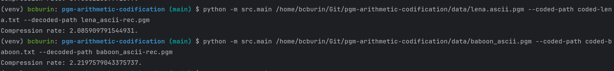

# Codificação Aritmética de Imagens PGM

## Requisitos

Deve-se ter instalada uma versão de Python igual ou superior à 3.10 e é, também, necessáio, instalar os requisitos para o funcionamento do programa.

```bash
pip install -r requirements.txt
```

## Funcionamento

Para sua execução, o programa oferece uma CLI. A utilização do comando de ajuda `python3 -m src.main -h` oferece uma especificação dos comandos dessa CLI.

```bash
usage: main.py [-h] [--coded-path CODED_PATH] [--decoded-path DECODED_PATH] [--block-size BLOCK_SIZE] [--precision PRECISION] path

positional arguments:
  path                  path to the image to encode

options:
  -h, --help            show this help message and exit
  --coded-path CODED_PATH
                        save path of the code stream (default=coded.pgm)
  --decoded-path DECODED_PATH
                        path to save the final decoded image (default=out.pgm)
  --block-size BLOCK_SIZE
                        block size to use for encoding (default=2)
  --precision PRECISION
                        floating point precision to use codification (default=50)

```

## Exemplo

Para executar o programa, basta informar o caminho para a imagem a ser codificada e quaiser outros parâmetros que se queira modificar, conforme os exemplos abaixo.

```bash
> python -m src.main /path/to/lena.ascii.pgm --coded-path coded-lena.txt --decoded-path lena_ascii-rec.pgm --precision 10
> python -m src.main /path/to/baboon_ascii.pgm --coded-path coded-baboon.txt --decoded-path baboon_ascii-rec.pgm --block-size 4
```

## Resultados

Uma vez finalizada a execução, mostra-se a taxa de compressão para o arquivo PGM selecionado. Para os arquivos `lena.ascii.pgm` e `baboon_ascii.pgm`, foram obtidos os seguintes.


